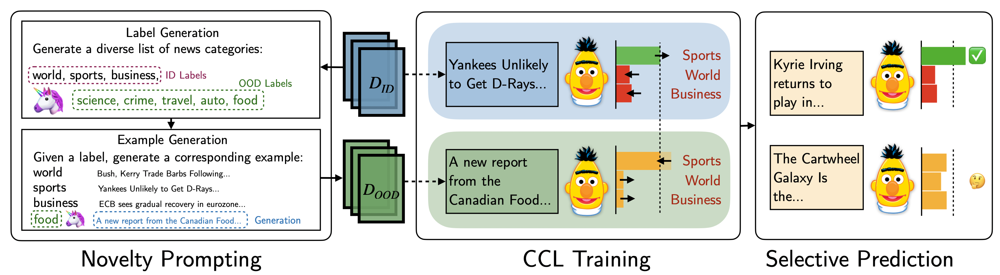

# Contrastive Novelty-Augmented Learning
This is the official code for the paper [CoNAL: Anticipating Outliers with Large Language Models](). This repository contains the code for replicating the all experiments including data splitting, generation, and augmented training, and is extensible with other OOD detection/selective prediction methods. Broadly, we generate OOD sets of examples from novel classes, then augment our training set and train with a confidence contrastive loss to reduce novel class overconfidence.

<p align="center">
  
</p>

## Dependencies

We train classifier models using [HuggingFace Transformers](https://github.com/huggingface/transformers). For label generation, we use the [OpenAI GPT-3 API](https://beta.openai.com/docs/api-reference?lang=python). You will need to register for an account on [the website](https://beta.openai.com/) to use GPT-3. Fortunately we do not need to make a large number of API calls, so the total cost of running the method is not high.

## Install

1. Clone the repo using `git clone https://github.com/albertkx/CoNAL.git`
2. Make a new virtual environment with Python 3.8.
3. Run `pip install -r requirements.txt`.
4. Download TACRED following https://nlp.stanford.edu/projects/tacred/#access.
5. Add your OpenAI API key in api\_keys.py
6. You may need to set up your Weights&Biases account for logging, following Step 1 [here](https://docs.wandb.ai/quickstart)

## Folder Structure

- `preprocessing/` contains code for creating training splits for the datasets we evaluate on: `TREC-10`, `Emotion`, `AGNews`, and `TACRED`, and additionally downloads Wikitext.
- `ood_generation/` contains code for generating OOD sets using novelty prompting or few-shot prompting on a LLM generator.
- `training/` contains code for training a classifier model augmented with an OOD set.
- `scoring/` contains utilities for scoring many models at once.

Additional folders will be created for the following:
- All training data splits will be located in `data/`.
- All generations will be saved to `generations/`.
- All model checkpoints will be saved to `models/`.

## Running Experiments

Examples of running all experiments are shown in the `Makefile`. Below are more specific details.

### Replicating Data Splits

To create both create the train data splits and download Wikitext:

```
python3 -m preprocessing.make_data
	--out_path data/
	--tacred_data_path /path/to/tacred/
```

### Generating OOD Sets

We provide three interchangeable scripts for generating OOD data, `generate_np.py`, `generate_zeroshot.py`, and `generate_fewshot.py`. All of them can be called with roughly the same parameters. Below is an example of generating 1000 OOD examples on the split 0 (where the class 0 is held-out) of the Emotion dataset. The names given to the model sizes can be found in `generation_utils.py`. 

```
CUDA_VISIBLE_DEVICES=0 srun --gres=gpu:1 -t 72:00:00 python3 -m ood_generation.generate_np \
	--dataset emotion \
	--gold_ood_class 0 \
	--model_size large \
	--num_generations 1000 \
	--generation_batch_size 16 \
	--example_generator_size large \
        --label_generator_size large \
	--output_dir_name test \
	--do_moby \
	--seed 1
```

By default, label and example generation use GPT-J 6B. Both of these generator models can be easily swapped out by changing parameters, e.g., by passing `gpt3` instead of `large`.

### Training Models

After generating an OOD example set, we can use this to augment the existing train set. To train with confidence contrastive loss:

```
CUDA_VISIBLE_DEVICES=0 python3 -m training.train_classifier
	data/trec10/0/
	models/trec10/0/bert_ccl_seed_1/
	--ood_training_type ccl
	--ood_path data/wikitext/
	--model_type bert_base
	--num_training_steps 5000
	--checkpoint_steps 100
	--seed 1
	--do_loss_log
```

We also implement [Outlier Exposure](https://arxiv.org/abs/1812.04606) training which can be called roughly the same way. See the recipe in the `Makefile` for how to run this: `make train_oe`.

### Scoring

To score all models of name `model_name_here` on all splits of dataset `dataset_name`, run `CUDA_VISIBLE_DEVICES=0 python3 -m scoring.score model_name_here dataset_name`. If your folder structure is different, you may need to modify `scoring/score.py`.

## Citation

```
@inproceedings{xu2023conal,
  author    = {Albert Xu and Xiang Ren and Robin Jia},
  title     = {CoNAL: Anticipating Outliers with Large Language Models},
  booktitle = {arXiv},
  year      = {2022},
}
```
